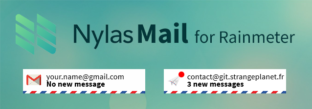

# Rainmeter NylasMail

Simple mails counter using https://nylas.com API.

## Setup

 1. Intall [curl](https://curl.haxx.se/download.html)
 2. Register on [Nylas](https://dashboard.nylas.com)
 3. Go to **Accounts** and add your email credentials
 4. Copy the Token in the `Variables.inc` file
 5. Configure the displayed email and the icon you want to use
 
(If you need more Mailbox skins, you can create new ones by running the `node generator.js 6` command and duplicate the configuration blocks in `Variables.inc`.)

## License

Code under MIT License.
