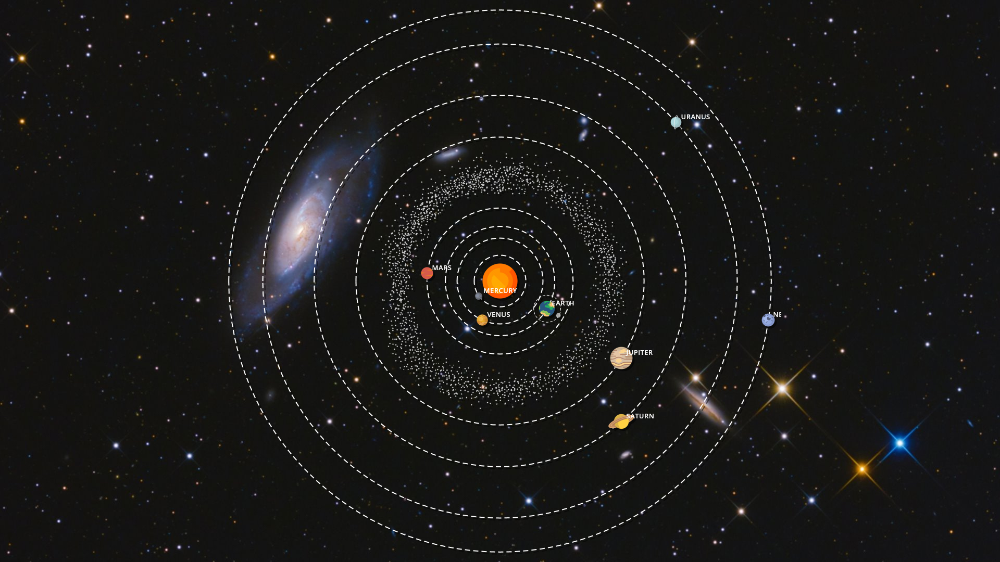
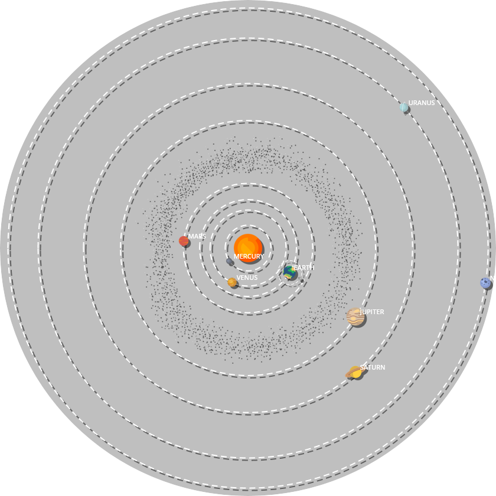
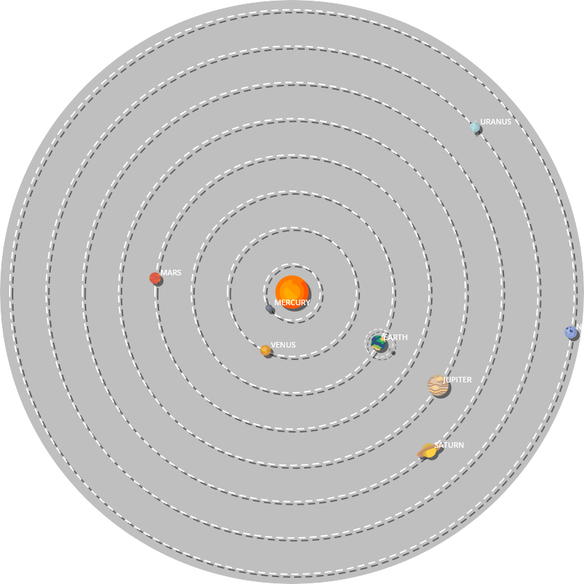
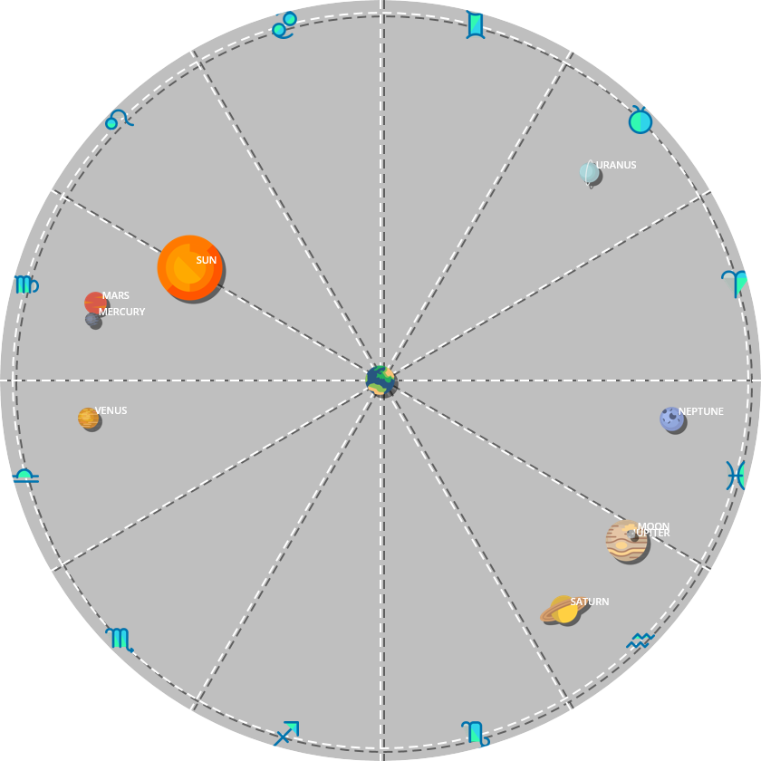

# Rainmeter SolarSystem

Skin showing a live representation of the solar system.

## Requirements

You must have [Node.js](https://nodejs.org) installed on your system.

## Configuration

Some options are available in the skin context menu :
- Mode
- Size
- Shadows
- Orbits
- Labels
- Background

Other options can be changed directly in the `[Variables]` section of the skin.

## Modes

### Logarithmic

Orbits are semi-major axis on a logarithmic scale. Also shows the asteroids belt.

### Linear

Orbits are equidistants.

### Geocentric

Planets are show from Earth point-of-view. Also shows the zodiac signs.

## Licence

Code under MIT License.

Icons : https://www.svgrepo.com
Font : https://www.opensans.com
Astronomy library : https://github.com/kshetline/tubular_astronomy
